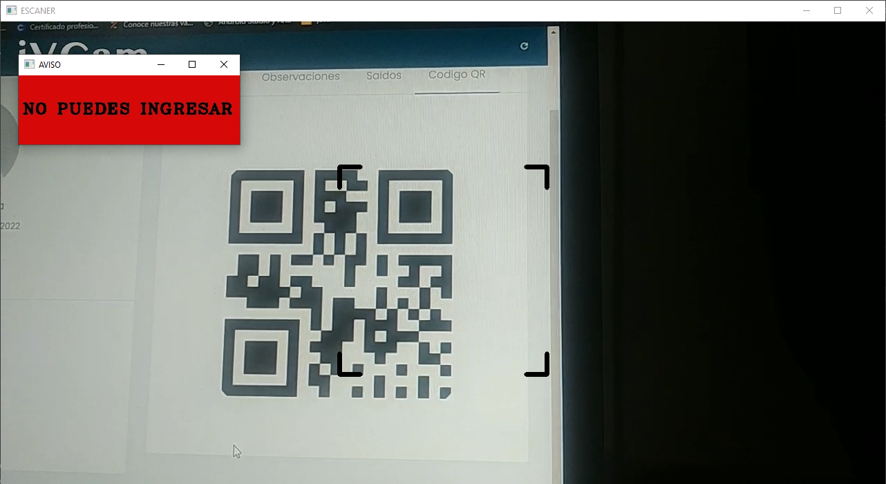

# Python-Opencv

 In this project, the OpenCV library is used to capture the image of a camera in order to read a QR code and validate it on a server to obtain the user's information. When the code is read, a pop-up window is displayed informing whether or not it can be accessed.

<h3>Note:</h3>

The web address is saved in the "url" variable to later make a request to the server.

